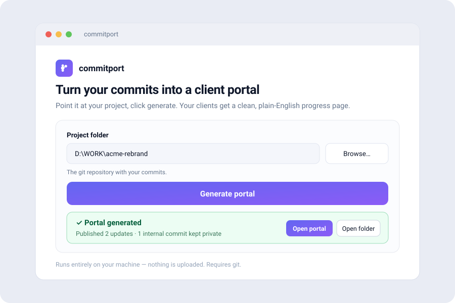

<div align="center">


# commitport

**Turn your git commits into a client-ready progress portal.**

Plain-English updates your clients can actually read — generated from the work you already did.
No database, no tracking, no status-update busywork.

[](https://commitport.com/#pricing)
&nbsp;
[](https://commitport.com/portal)


<br/>



</div>

---

> ### ⭐ Source-available — read it, audit it; a one-time license unlocks real use
> The full source is public so you can **read and audit** exactly what runs on your machine (including the leak-guard you're trusting with your commits). Building and evaluating from source is free; **using commitport for client, business, or production work — and the prebuilt Windows app + CLI bundle — requires a one-time license.**
> **→ [Get yours at commitport.com](https://commitport.com/#pricing) — €9, one-time.** Takes 30 seconds and funds the project.

---

## What it does

You keep writing normal technical commits for your team. Mark the handful a client should see — with a
gitmoji (`✨ 🐛 🔒 ⚡`), a `(client)` scope, or a `Client:` trailer — and commitport reads your git log,
**filters out the noise**, **translates the survivors from _implementation_ into _impact_**, and emits a
clean static portal your clients can follow.

```
your commits ──▶ commitport ──▶ a portal your clients can read
                 (filter → translate → leak-guard → render)
```

- 🗄️ **Database-free.** Your git history *is* the database. Output is static `index.html` + `data.json` — host it anywhere.
- 🔒 **Privacy-first.** Only the commits you mark are published, and only their translated text — never hashes, author emails, internal scopes, or clock times. A built-in **leak guard** fails the build if anything secret-shaped would go public.
- ⚡ **Zero runtime.** The styling is inlined, so the portal loads with no JS and no external requests. Dark mode included.
- 📡 **Subscribable + automatable.** Set a public URL and it also emits an Atom feed (`feed.xml`) clients can follow in any reader, plus a JSON Feed (`feed.json`) you can pipe into Slack, Zapier, or a dashboard without parsing XML.

## See it in action

- 🔗 **Live demo portal** — <https://commitport.com/portal>
- 📜 **commitport's own changelog** (it dogfoods itself) — <https://commitport.com/changelog>

## Get commitport

**The easy way — a simple Windows app (recommended):**

1. **[Buy a license](https://commitport.com/#pricing)** (one-time).
2. Download **`commitport-setup.exe`** and run it — no Node, no setup, installs in seconds (no admin needed).
3. Open **commitport**, pick your project folder, click **Generate portal**. Done.

<div align="center">

### [👉 Buy a license & download — commitport.com](https://commitport.com/#pricing)

</div>

Prefer the terminal? The same app is also a CLI:

```bash
commitport init             # scaffold a config (--template agency|freelancer|changelog)
commitport build            # generate the portal into ./public
commitport build --watch    # rebuild automatically on each new commit or config edit
commitport verify           # re-check ./public against its manifest.json
commitport stats            # print a publish summary (by category) without writing
commitport doctor           # check the setup and explain why nothing would publish
```

> You only need **git** installed. A license is still required to use it — see [License](#license--pricing).

Every build also drops a **shareable update** next to the portal: `email.html` (a self-contained snippet you paste into your mail client) and `update.md` (paste into email, Slack, anywhere), covering the last 7 days. Clients read email, not portals — commitport writes the update for you to send; it never sends anything itself. Turn it off with `"emailDigest": false`. Set `"embed": true` to also emit `embed.html`, a self-contained "latest updates" widget you can `<iframe>` into your own site.

**Automate it:** copy [`examples/github-actions-portal.yml`](examples/github-actions-portal.yml) into your repo's `.github/workflows/` to rebuild and publish your portal to GitHub Pages on every push.

## How to flag commits for clients

This is the only behavior change your team needs — keep using [Conventional Commits](https://www.conventionalcommits.org/), and add a marker when a commit should reach the client.

**Published if ANY of these is true:**

1. It starts with a **client-facing gitmoji** — `✨ 🚀 🚑 🐛 🔒 ⚡ 📝 💄 🌐 ♿` (or `:sparkles:`, `:bug:`, …).
2. Its **scope** is `(client)` or `(public)`.
3. Its body ends with a real **`Client:` trailer** — that text is shown *verbatim* (your exact words). Best for anything important.

**Stays internal otherwise** — and the `internal / ci / deps / build / test` scope denylist **beats everything**, including a gitmoji or trailer. Privacy always wins.

```bash
# ── Shows on the portal ───────────────────────────────
git commit -m ":sparkles: feat: add CSV export to the dashboard"
git commit -m "feat(client): redesign the dashboard for mobile"
git commit -m "fix: null check in webhook" -m "Client: Notifications now arrive reliably."

# ── Non-code milestones (design, meetings, approvals) ─
# Not all client-facing progress is a code change. Log it as a marked EMPTY
# commit — a Client: trailer gives you the exact wording:
git commit --allow-empty -m ":handshake: chore(client): design sign-off" \
  -m "Client: Your homepage design is approved — development starts Monday."
git commit --allow-empty -m ":art: chore(client): delivered brand mockups"

# ── Stays internal ────────────────────────────────────
git commit -m "chore(deps): bump eslint"
git commit -m "refactor(auth): extract token validation"
```

**One repo, several clients?** Add `profiles` to your config and commitport emits a separate, branded portal per client into `public/<out>`, filtered to that client's scope:

```json
"profiles": [
  { "name": "Acme",   "out": "acme",   "scopes": ["acme"],   "site": { "title": "Acme — Progress" } },
  { "name": "Globex", "out": "globex", "scopes": ["globex"] }
]
```

Then `feat(acme): …` lands only in Acme's portal and `fix(globex): …` only in Globex's — one client never sees another's work. An index of all your portals is written to the output root for your own use; it names every client you serve, so it's `noindex` and isn't meant to be handed to any single client.

**Client wants a PDF?** Every portal carries a print stylesheet — Print → Save as PDF gives a clean light-on-white document that keeps each update whole across page breaks and prints the portal's address.

## Action → impact translation

Clients care about impact, not implementation. commitport rewrites each message (first match wins):

| Commit | Portal |
|--------|--------|
| `:sparkles: feat: migrate auth to new JWT standard` | ✨ Upgraded login to a new secure sign-in |
| `:zap: perf(api): optimize database query indexing` | ⚡ Sped up data lookups |
| `:lock: perf(security): encrypt session tokens at rest` | 🔒 Secured login sessions |

A `Client:` trailer is used **exactly as written**; everything else uses an offline, configurable dictionary; and `--ai` (opt-in, needs your own API key) adds the most natural phrasing. It all lives in [`config/portal.config.json`](config/portal.config.json) — markers, dictionary, title, accent color. Industry **vocab packs** (`"vocabPacks": ["saas", "ecommerce", "fintech", "agency", "mobile"]`) layer ready-made jargon→plain mappings on top; your own dictionary always wins. Set `"voice": "we"` for first-person copy ("We launched…").

**Screenshots** — add an `Image:` trailer (e.g. `Image: docs/shots/dashboard.png`) to attach a visual to an entry. The image is read from your repo and **inlined as a `data:` URI**, so the portal stays a single self-contained file that loads nothing over the network. Paths are confined to the repo, size-capped, and limited to PNG/JPG/GIF/WebP. Images are embedded as-is — metadata (EXIF) is **not** stripped, so the media you attach is your responsibility.

## Privacy & security

The pipeline is hardened end to end:

- **Leak guard** — the build **fails** if any to-be-published text matches a secret / credential / email / IP / internal-hostname pattern.
- **Day-resolution dates** — no clock times or timezone offsets reach the output (no working-hours fingerprinting).
- **Output encoding** — every commit-derived string is HTML-escaped under a strict CSP (`default-src 'none'`, images limited to inlined `data:` URIs); zero JS.
- **Genuine trailers only** — `Client:` is parsed by git's own trailer parser; the internal-scope denylist can't be bypassed.
- **AI egress gate** (only with `--ai`) — guard-flagged commits are never sent to the API; responses are length-capped and URL/email-rejected.
- **Verifiable output** — every build writes a `manifest.json` of SHA-256 hashes; `commitport verify` re-checks the published files byte-for-byte. The build is deterministic, so a clean rebuild reproduces the same hashes.

## License & pricing

commitport is **source-available commercial software** — see [LICENSE](LICENSE). The code is public for transparency and audit; it is **not** OSI open source.

- 👀 **Free, no license needed:** view, audit, fork, modify, build from source, and evaluate locally.
- 💳 **License required (€9, one-time):** any client, business, or production use — and the prebuilt Windows app + CLI bundle from [commitport.com](https://commitport.com).
- 🚫 You **may not** resell, sublicense, or redistribute it (source or binaries) as a competing product.

**€9, one-time** — a single license covers **unlimited projects** for one organization. Buy once, self-host forever.

<div align="center">

### [💜 Buy a license — commitport.com](https://commitport.com/#pricing)

</div>

Full terms in [`LICENSE`](LICENSE) and at <https://commitport.com/terms>.

## Build from source

Pure standard-library Node — no dependencies to install (a license is still required to *use* the result).

```bash
npm run demo       # build a sample repo and generate a portal into ./public
npm run preview    # serve it at http://localhost:8080
npm run build      # run it against THIS repo's history
npm test           # the test suite (node:test, zero deps)
```

Packaging the Windows app + installer (maintainers): `npm run build:exe` then `npm run build:installer`
(needs [Inno Setup](https://jrsoftware.org/isinfo.php): `winget install JRSoftware.InnoSetup`).

---

<div align="center">

**[commitport.com](https://commitport.com)** · [Live demo](https://commitport.com/portal) · [Changelog](https://commitport.com/changelog) · [Pricing](https://commitport.com/#pricing)

Made for agencies and freelancers who'd rather ship than write status reports.

</div>
